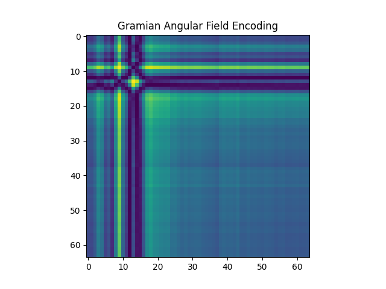
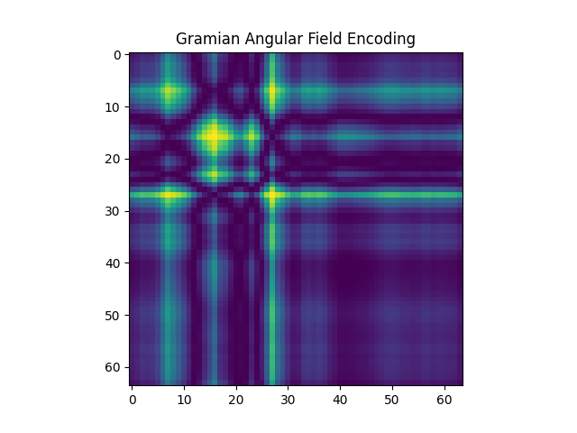
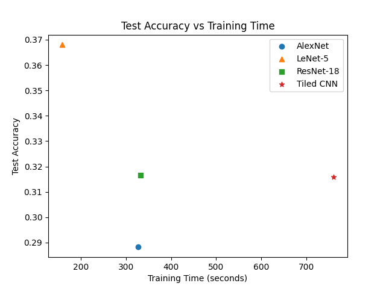
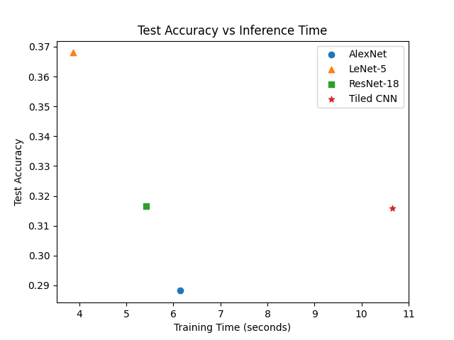
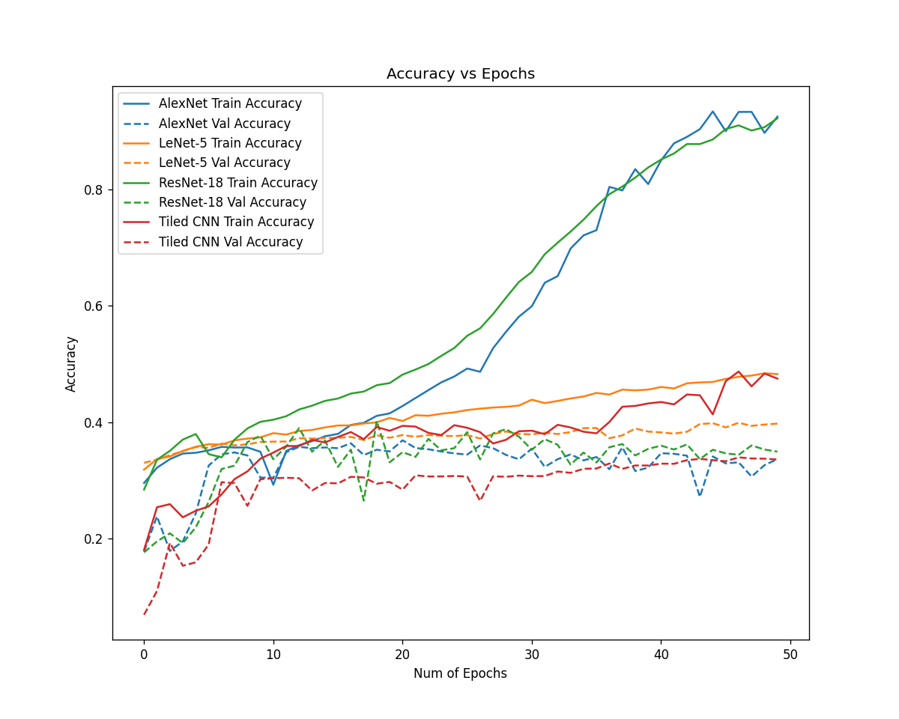
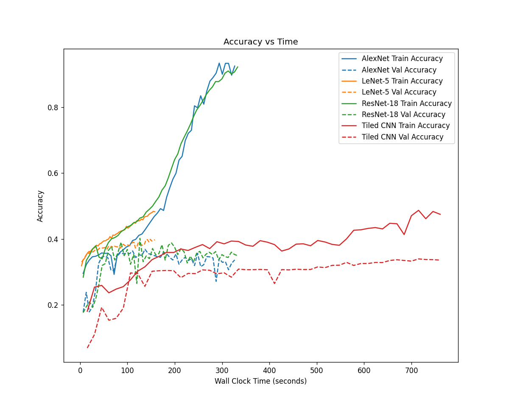
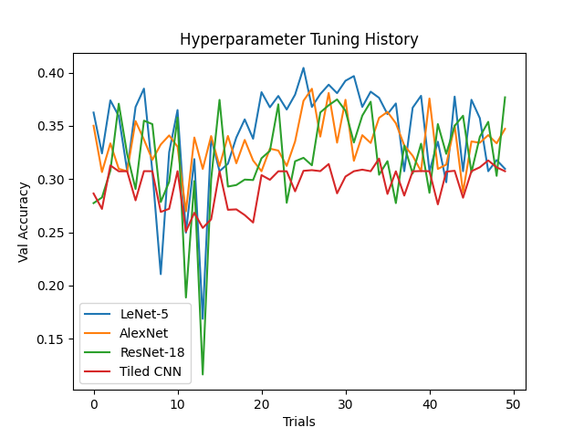

# Benchmarking Performance of CNN Architectures for Classifying Time Series Encoded as Images

This repo is for COMSE6998 Final Project Benchmarking Performance of CNN Architectures for Classifying Time Series Encoded
as Images.

## Project Description

### Overview

The goal of this project is to benchmark and understand the performance of different CNN architectures for classifying time series encoded
as images.

In this project, we use the [MosquitoSound](http://www.timeseriesclassification.com/description.php?Dataset=MosquitoSound) dataset from the UCR
Time Series Classification Repository. The dataset contains 279,566 instances of univariate time series of length 3,750. The task is to classify 
the pseudo-acoustic series (captured by infrared sensors) produced by insect wingbeat into 6 categories (of mosquitos). 

We encode time series as images using the Gramian Angular Field (GAF) method, and benchmark the image classification using AlexNet, LeNet-5, ResNet-18,
and Tiled CNN. We tune hyperparamters before benchmarking so that the measured performance is a good represnetation of each model's potential. We measure
test accuracy, traing time, and inference time.

We also provide evaluation and analysis of the benchmarking results.

### Implementation

#### Encoding

For encoding we adopt the GAF method. We also explored the Markove Transition Field method. However, because the latter method requires
a significant amount of RAM, we give up after various attempts. Therefore, in our benchmarking, the images are only encoded with GAF.

We use the Pyts library to encode time series as images. See `encoding.py` for details.

#### Models

The models are built with Tensorflow and Keras. In order to implement Tiled CNN, we create a custom Convolutional layer in Keras. The code
for building the model is in `tcnn.py`, `resnet18.py`, and in other tuning scripts. We mostly embed the modelling scripts in the tuning
scripts, due to the way Hyperas uses template, and importing could be tricky otherwise.

#### Hyperparameter Tuning

Hyperparameter tuning is done using [Hyperas](https://github.com/maxpumperla/hyperas) and [Hyperopt](http://hyperopt.github.io/hyperopt/). 
Hyperopt implements Bayesian optimization, which uses the Bayesian Theorem to efficiently search through the tuning space. We run 50 trials 
for each model, and within each trial, each model is trained for 50 epochs. We believe 50 epochs provide good indication of the relative
performance of the hyperparameter choice.

Hyperparameter seach space is shown below

| Hyperparameter | Search Space |
| -------------- | :----------: |
| Weight Initializer | HeNormal, GlorotUniform |
| Batch Size | 256, 512, 1024, 2048 |
| Optimizer | Adam, SGD, Nadam, AdaGrad |
| Learning Rate | [1e-5, 1] |

Note learning rate was sampled from 1e-5 to 1 using loguniform.

Tuning code is in `tune_alexnet.py`, `tune_lenet.py`, `tune_resnet18.py`, `tune_tcnn.py`. The tuning history is also recorded.

#### Benchmarking

We benchmark the models with the best hyperparameters on GCP Compute Engine. The VM configuration is shown below

| | Configuration | 
| -- | :--------: |
| Machine Type | N1-Standard-8 |
| CPU | 8vCPU |
| GPU | V100x1 |
| RAM | 32GB |
| Environment | Tensorflow Enterprise 2.8 |
| OS | Debian |

We record test accuracy, training time, and inference time.

## Results and Observations

### Encoding Examples





### Benchmarking Results





| Model | Test Accuracy | Training Time (seconds) | Inference Time (seconds) |
| ----- | :-----------: | :---------------------: | :----------------------: |
| LeNet-5 | 36.80% | 157.97 | 3.86 |
| AlexNet | 28.82% | 326.67 | 6.14 |
| ResNet-18 | 31.65% | 332.91 | 5.42 |
| Tiled CNN | 31.59% | 760.74 | 10.66 |







## Repo Description

The repo structure is rather simple. All the tuning and benchmarking scripts are located at the repo root. 

Scripts that start with `benchmark_` are the benchmarking scripts, and scripts that start with `tune_` are the 
tuning scripts. `resnet.py` and `tcnn.py` contains functions and classes for building ResNet-18 and Tiled CNN.

There should be a `data` folder for storing data, a `benchmark` folder fore storing benchmarking results, a `history`
folder for storing tuning history, and a `runs` folder for storing the best hyperparameters. However, they are not
committed into the git repo due to their size.

Notebooks for generating the graphs are not included in the repo.

## Running the Code

### Environment

All libraries required can be installed by running in a virtual environment

```shell
pip install -r requirements.txt
```

There might be extra configuration needed for tensorflow if you'd like to use CUDA.

### Encoding

After downloading the data, simply run `encoding.py` to encode data as images. The file paths should be evident from
the code.

### Hyperparameter Tuning

Create necessary empty folders mentioned above, and simply run the tuning scripts (starting with `tune_`). The results will be stored in `history`
and `runs` folders. Note that we are not storing trained models during tuning.

### Benchmarking

Run the benchmarking scripts (starting with `benchmark_`). The results and models will be stored in `benchmark` folder.